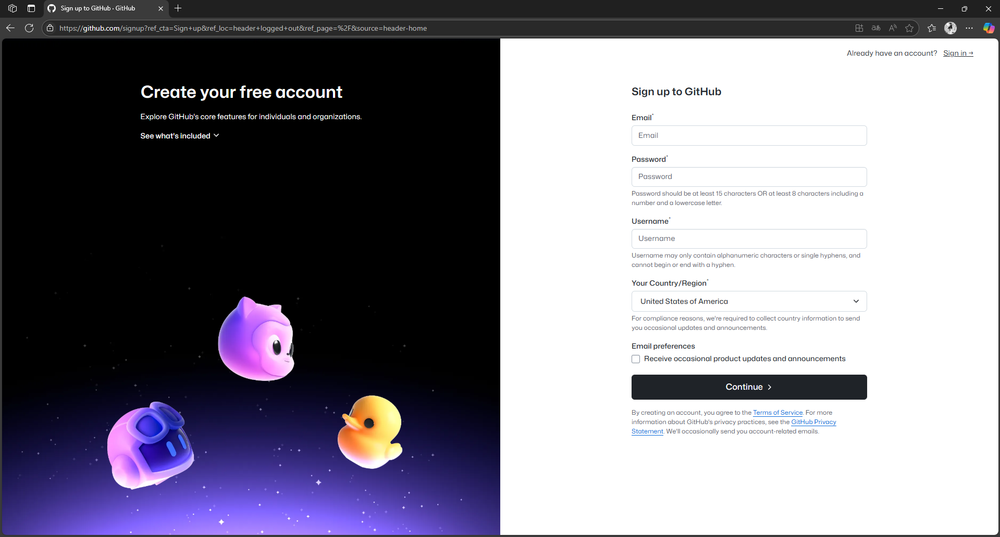
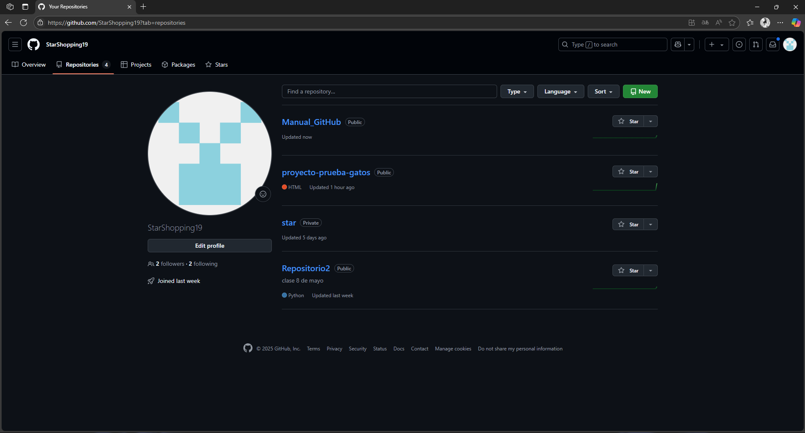
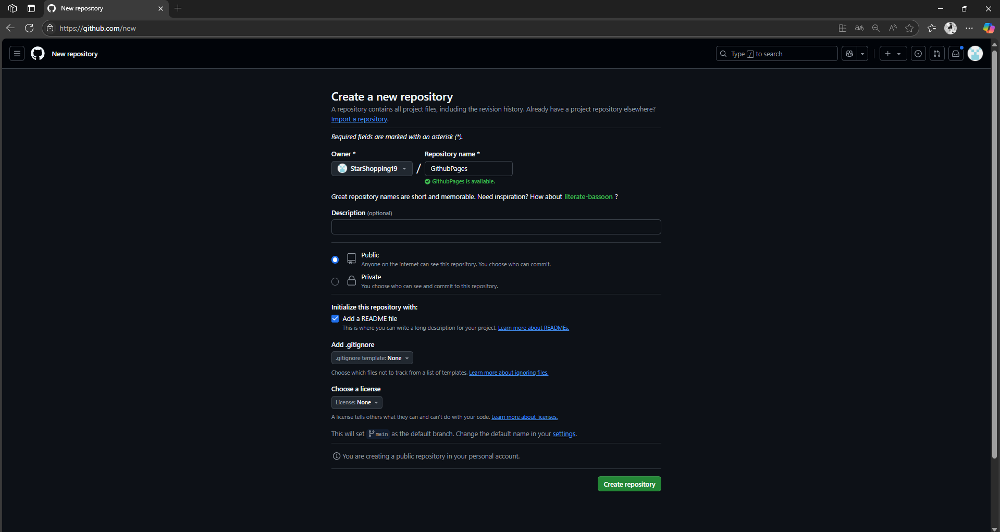
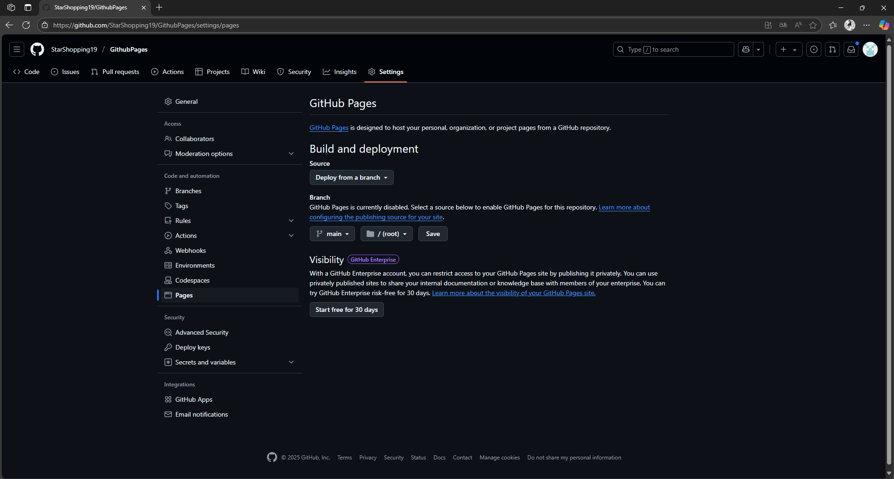
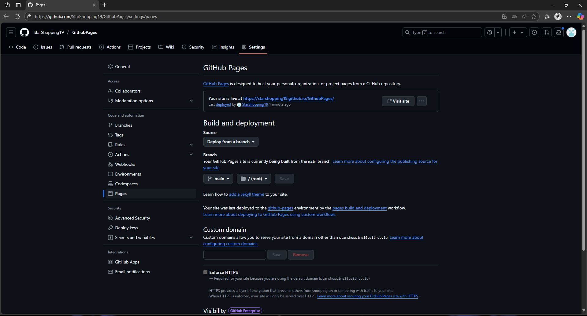
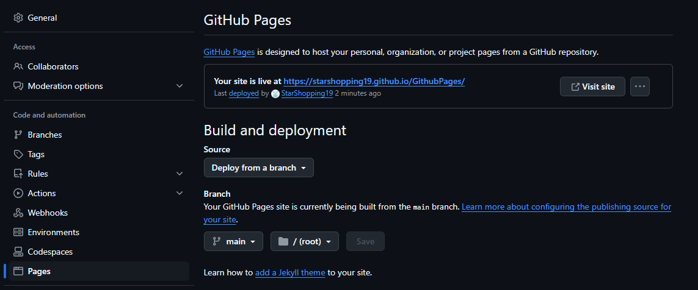

# ¿Cómo usar Github Pages para la publicación de Páginas web?

  

## ¿Qué es Github Pages?
GitHub Pages es un servicio que permite a los usuarios alojar sitios web directamente desde un repositorio de GitHub. Está diseñado para proyectos personales, documentación y páginas de presentación
## Beneficios de usar Github Pages
- Gratuito y fácil de usar: No requiere configuraciones complejas ni pagos para alojar sitios web estáticos
- Personalización de dominio: Puedes usar tu propio dominio para darle un aspecto más profesional a tu sitio
- Ideal para documentación: Es una excelente opción para alojar documentación de proyectos de software
# El primer paso es crear una cuenta de Github 

Para eso debemos ir al sitio web oficial de Github y registrarnos

  

# El segundo paso es dirigirse al apartado de repositorios y crear uno nuevo

  

  

# El tercer paso es cambiar el Branch de "None" a "Main" y le damos a "Save"

## Para esto primero debemos ir a la pestaña de settings del repositorio y seleccionar la opción "Pages"

  

## Luego de unos cuantos minutos nos aparecerá en la misma pestaña la url del sitio web, el cual estará vacio puesto que en el repositorio solo está el archivo README, para llenarlo habrá que crear el index del sitio web

  

  

