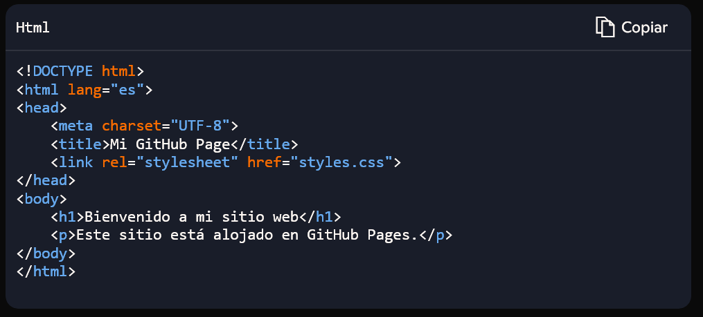
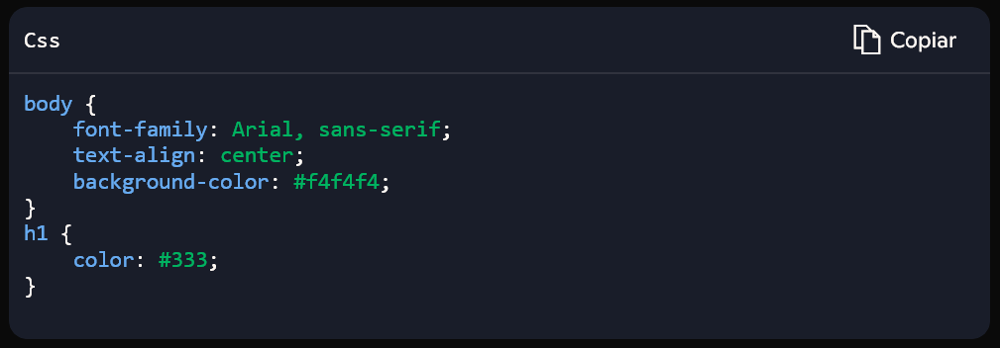

# 🚀 ¿Cómo usar GitHub Pages para la publicación de Páginas web? 🌐

<div align="center">
  
</div>

## 🤔 ¿Qué es GitHub Pages?
GitHub Pages es un servicio que permite a los usuarios alojar sitios web directamente desde un repositorio de GitHub. Está diseñado para proyectos personales, documentación y páginas de presentación, facilitando así mostrar tu portafolio o compartir tus proyectos en línea. 💻

## 🎯 Beneficios de usar GitHub Pages
- **Gratuito y fácil de usar:** No requiere configuraciones complejas ni pagos para alojar sitios web estáticos. 💸  
- **Personalización de dominio:** Puedes usar tu propio dominio para darle un aspecto más profesional a tu sitio. 🌟  
- **Ideal para documentación:** Es una excelente opción para documentar y compartir proyectos de software. 📚  

---

### 1️⃣ Primer paso: Crear una cuenta en GitHub
Visita el sitio web oficial de GitHub para registrarte. Una cuenta es el punto de partida para acceder a todas sus funcionalidades. 🔑

<div align="center">
  
</div>

---

### 2️⃣ Segundo paso: Crear un repositorio nuevo
Una vez dentro de tu cuenta, dirígete a la sección de repositorios y crea uno nuevo. Este repositorio servirá como la base de tu sitio web. 🏗️

<div align="center">
  
</div>

<div align="center">
  
</div>

---

### 3️⃣ Tercer paso: Configurar GitHub Pages
#### a) Seleccionar el Branch "Main"
Entra en la pestaña de **Settings** del repositorio y selecciona la opción **Pages**. Cambia el branch de "None" a **Main** y presiona **Save**. 🔄

<div align="center">
  
</div>

#### b) Crear el archivo `index`
Después de unos minutos, en la misma pestaña verás aparecer la URL de tu sitio web. Inicialmente estará vacío, ya que solo se encuentra el archivo README en el repositorio. Para empezar a mostrar contenido, crea un archivo `index` (puede ser `index.html` o `index.md`) donde podrás editar y personalizar tu página. 📝

<div align="center">
  
</div>

<div align="center">
  
</div>

---


## 📘 Creación y personalización de un Sitio Web con GitHub Pages
A continuación se presenta una breve guía sobre cómo crear y personalizar un sitio web:

---

### 1️⃣ Usar Markdown o HTML/CSS para diseñar el sitio:
GitHub Pages puede trabajar con Markdown y HTML para estructurar el sitio:
- 🔹 Markdown (````.md````) es ideal para documentación, permitiendo escribir contenido de manera simple.
- 🔹 HTML (````.html````) da más control sobre el diseño y estructura.
- 🔹 CSS (.css) permite personalizar estilos y mejorar la apariencia visual.
Este puede ser una estructura básica en HTML con CSS para crear un archivo ````index.html````:

<div align="center">
  
</div>

Y puedes agregar un ````styles.css````:

<div align="center">
  
</div>

---

### 2️⃣ Configurar el archivo ````index.html```` y otros recursos:
- 🔹 Coloca tu ````index.html```` en la raíz de tu repositorio para que GitHub Pages lo reconozca.
- 🔹 Añade imágenes y archivos CSS en carpetas organizadas (````img/````, ````css/````, etc.).
- 🔹 Si usas Markdown, asegúrate de tener un archivo ````README.md```` o convertir ````.md```` en HTML si deseas mostrar contenido personalizado.

✅ Activar GitHub Pages:
- Ve a ````Settings```` en tu repositorio.

<div align="center">
  
</div>

- Dirígete a ````Pages```` en el menú lateral.
- En ````Source````, selecciona la rama (por ejemplo, ````main````).
- Guardar cambios.

GitHub generará tu sitio en: https://usuario.github.io/repositorio/

---

### 3️⃣ Personalización del dominio con un archivo CNAME:
Si deseas usar un dominio personalizado, sigue estos pasos:
- 🔹 Crea un archivo CNAME en la raíz del repositorio.
- 🔹 Escribe tu dominio en el archivo, sin ````"http://"```` ni ````"www"````. Por ejemplo: ````midominio.com````
- 🔹 Configura tu dominio desde el panel de GitHub Pages en ````Settings > Pages > Custom Domain````.
- 🔹 Añade registros **CNAME** en tu proveedor de dominio, apuntando a ````usuario.github.io````.


