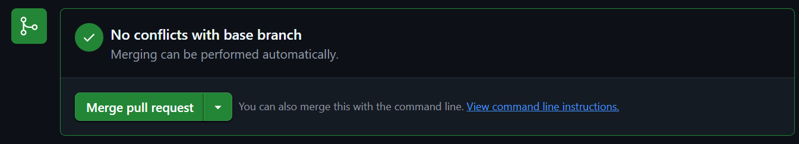

<div align="center">
  
</div>

# **¿CÓMO USAR GITHUB PULL REQUESTS? Una breve guía de inicio rápido 🔄**
## **Introducción a GitHub Pull requests** 🔄

Los **Pull Requests (PRs)** 🔄 en **GitHub** son una herramienta esencial para la colaboración en proyectos de desarrollo. Permiten a los equipos trabajar en código de forma ordenada, proponer cambios y revisarlos antes de integrarlos en la rama principal.

Un **Pull Request**  🔄 es una solicitud para que los cambios realizados en una rama sean revisados y, eventualmente, integrados en otra rama del repositorio. Es especialmente útil en proyectos donde múltiples desarrolladores trabajan en paralelo.
Cuando alguien propone cambios, los miembros del equipo pueden:
- Revisar el código,
- Comentar sugerencias y correcciones,
- Probar la funcionalidad,
- Aprobar o rechazar la incorporación del código a la rama principal.

---

## **Explicación del flujo de trabajo en GitHub** 🔄

El uso de GitHub sigue un flujo de trabajo estructurado para garantizar que los cambios en el código sean organizados y revisados adecuadamente. En esta guía vamos a proporcionar los comandos que deben ser utilizados desde Git Bash.

🔹 1. Creación de una rama: Antes de modificar el código, se recomienda crear una nueva rama en el repositorio. Esto permite trabajar sin afectar la rama principal.

<div align="center">
  
</div>

🔹 2. Realización de cambios y confirmación (````commit````): Después de modificar archivos, se registran los cambios en Git con ````git commit````.

<div align="center">
  
</div>

🔹 3. Envío de la rama al repositorio remoto: Para compartir los cambios en GitHub, se sube la rama con ````git push````.

<div align="center">
  
</div>

🔹 4. Revisión del código y colaboración: Una vez los cambios están en el repositorio remoto, los miembros del equipo pueden revisar el código, hacer comentarios y sugerir ajustes para mejorar la calidad del código antes de integrarlo en la rama principal.

🔹 5. Resolución de observaciones y ajustes: Si se detectan mejoras o errores en el código, se pueden realizar correcciones dentro de la misma rama y volver a subir los cambios con ````git commit```` y ````git push````.

🔹 6. Aprobación de los cambios: Antes de fusionar los cambios en la rama principal, es fundamental asegurarse de que han sido revisados y aprobados por el equipo.

---

## **Comandos básicos de Git relacionados** 🔄
Para trabajar con Git y gestionar cambios en un repositorio, es importante dominar algunos comandos esenciales. Aquí tienes una lista de los más relevantes:

📌 Configuración Inicial: Antes de empezar a usar Git, puedes configurar tu usuario y correo...

<div align="center">
  <pre>git config --global user.name "Tu Nombre"</pre></div>

<div align="center">
  <pre>git config --global user.email "tu@email.com"</pre></div>

🔹 Creación y Gestión de Repositorios:
- Inicializar un repositorio Git:

<div align="center">
  <pre>git init</pre></div>
- Clonar un repositorio remoto:
<div align="center">
  <pre>git clone URL-del-repositorio</pre></div>

🔹 Manejo de Ramas:
- Listar ramas en el repositorio:

<div align="center">
  <pre>git branch</pre></div>
- Crear una nueva rama:

<div align="center">
  <pre>git checkout -b nombre-de-la-rama</pre></div>
- Cambiar a otra rama:

<div align="center">
  <pre>git checkout nombre-de-la-rama</pre></div>
- Eliminar una rama local:

<div align="center">
  <pre>git branch -d nombre-de-la-rama</pre></div>

🔹 Realización de Cambios:
- Ver el estado de los archivos modificados:

<div align="center">
  <pre>git status</pre></div>
- Añadir archivos al área de preparación:

<div align="center">
  <pre>git add nombre-de-archivo</pre></div>
- O para añadir todos los archivos modificados:

<div align="center">
  <pre>git add .</pre></div>
- Guardar los cambios con un mensaje:

<div align="center">
  <pre>git commit -m "Mensaje describiendo los cambios"</pre></div>
- Ver historial de commits:

<div align="center">
  <pre>git log</pre></div>

🔹 Trabajo con Repositorios Remotos:
- Conectar el repositorio local con uno remoto:

<div align="center">
  <pre>git remote add origin URL-del-repositorio</pre></div>
- Subir los cambios al repositorio remoto:

<div align="center">
  <pre>git push origin nombre-de-la-rama</pre></div>
- Actualizar el repositorio con cambios remotos:

<div align="center">
  <pre>
git pull origin nombre-de-la-rama</pre></div>

---

## **Crea el Pull Request** 🛠️

Una vez que tu rama ha sido subida a GitHub, es momento de abrir el Pull Request (PR):

1. Dirígete al repositorio en GitHub.
2. Verás un botón que dice **"Compare & pull request"** — haz clic.
<div align="center">
  
</div>

3. Completa los siguientes campos:
- ✍️ **Título**: claro y directo sobre el cambio.
- 📄 **Descripción**: explica qué hiciste, por qué y cómo afecta el proyecto.
- 🔗 **Referencia a Issues (opcional)**: si tu PR soluciona un Issue, escríbelo así:  
     `Closes #23` → esto cerrará automáticamente el issue #23 al hacer merge.
---

## **Espera revisión y responde feedback** 🔧 

Cuando se abre el Pull Request, el equipo podrá:

- 👀 Leer el código.
- 💬 Comentar sugerencias o correcciones.
- ✅ Aprobarlo o solicitar cambios.

Si se te solicita hacer ajustes, puedes realizarlos desde el local y subir los cambios (como se mencionó anteriormente)

```bash
git add .
git commit -m "Aplicar correcciones sugeridas"
git push
```
---

## **Aprobar y fusionar el Pull Request** ✅

Una vez revisado y aprobado por al menos un miembro del equipo (según configuración del repositorio), puedes hacer merge del PR. Hay tres formas comunes:

- 🔀 Merge commit: crea un commit adicional que une las ramas.

- 🧼 Squash and merge: combina todos los commits en uno solo.

- 🔁 Rebase and merge: reescribe el historial a la rama base para mantenerlo lineal.

Haz clic en "Merge pull request" para finalizar el proceso.
<div align="center">
  
</div>

---

## **Buenas prácticas al trabajar con Pull Requests** 📌

✍️ Usa títulos y descripciones claros.

👥 Asigna revisores (@usuario) **si es necesario.**

📎 Relaciona los PR con Issues existentes.

🧪 Asegúrate de probar el código antes de abrir el PR.

📂 Borra la rama luego de fusionar si ya no se necesita.

---

# 🔄 Ejemplos de Pull Requests en Proyectos Reales

Los Pull Requests son esenciales para mejorar la calidad del código y fomentar la colaboración en equipos de desarrollo. A continuación, te mostramos tres ejemplos prácticos:

---

## 🐛 1. Corrección de Errores (Bug Fixes) 

  Cuando se detecta un error en la aplicación, es importante aislar la solución sin afectar la rama principal.

## 🚀 2.Implementación de Nuevas Funcionalidades

  Para agregar una nueva característica, se utiliza un PR que asegure una revisión colaborativa del nuevo código
  
## 📚 3. Mejoras en la Documentación

  Actualizar la documentación es tan importante como modificar el código. Un PR dedicado a la documentación mejora la claridad y la accesibilidad del proyecto.

## *🛠 Errores comunes en GitHub Pull Requests y cómo solucionarlos*

### *⿡ Conflictos de fusión (Merge Conflicts)*
*🔹 Problema:*  
Cuando intentas fusionar un Pull Request, Git detecta cambios en la rama base que entran en conflicto con los cambios de tu PR.  

*✅ Solución:*  
1. Ve a tu repositorio local y cambia a la rama de tu PR:  
   bash
   git checkout mi-rama
   
2. Obtén los últimos cambios de la rama base:  
   bash
   git fetch origin
   git merge origin/main
   
3. Resuelve los conflictos manualmente en los archivos afectados.  
4. Confirma los cambios y sube la actualización:  
   bash
   git add .
   git commit -m "Resolviendo conflictos de fusión"
   git push origin mi-rama
   

---

### *⿢ Commits desordenados o innecesarios*
*🔹 Problema:*  
Tu Pull Request tiene demasiados commits pequeños o irrelevantes, lo que dificulta la revisión.  

*✅ Solución:*  
1. Usa git rebase para combinar commits:  
   bash
   git rebase -i HEAD~n  # Reemplaza "n" con el número de commits a modificar
   
2. Marca los commits innecesarios como squash para fusionarlos.  
3. Guarda los cambios y sube la rama con git push --force.

---

### *⿣ PR basado en una rama incorrecta*
*🔹 Problema:*  
Tu Pull Request se creó desde una rama equivocada y no refleja los cambios correctos.  

*✅ Solución:*  
1. Cambia a la rama correcta en tu repositorio local:  
   bash
   git checkout main
   
2. Crea una nueva rama basada en main:  
   bash
   git checkout -b nueva-rama
   
3. Aplica los cambios y sube la nueva rama:  
   bash
   git push origin nueva-rama
   
4. Cierra el PR anterior y abre uno nuevo con la rama correcta.

### *🚨 Recuperar una rama borrada antes de hacer merge en GitHub*

*🔹 Problema:* 
Has eliminado una rama en GitHub antes de fusionarla con main y necesitas recuperarla.

*✅ Solución:*
#### *⿡ Si la rama estaba en GitHub y fue eliminada*
Si la rama estaba en un *Pull Request cerrado*, puedes restaurarla desde la interfaz de GitHub:
1. Ve al repositorio en GitHub.
2. Dirígete a la pestaña *Pull Requests*.
3. Haz clic en *Closed* para ver los PR cerrados.
4. Busca el PR de la rama eliminada.
5. En la parte inferior, haz clic en *Restore branch*.

<div align="center">
  
</div>

#### *⿢ Si la rama fue eliminada localmente*
Si la rama fue eliminada en tu máquina pero aún existe en GitHub, puedes recuperarla con:
bash
git fetch origin
git checkout -b mi-rama origin/mi-rama

Esto traerá la rama desde el repositorio remoto.

#### *⿣ Si la rama fue eliminada sin haber sido subida a GitHub*
Si la rama solo existía localmente y fue eliminada, puedes intentar recuperarla con git reflog:
bash
git reflog

Esto mostrará un historial de cambios recientes. Busca el commit más reciente de la rama eliminada y usa:
bash
git checkout -b mi-rama <commit-hash>

Reemplaza <commit-hash> con el identificador del último commit de la rama.

#### *⿤ Si no recuerdas el commit de la rama eliminada*
Puedes buscar commits huérfanos con:
bash
git fsck --full --no-reflogs | grep commit

Esto listará commits que no están en ninguna rama activa. Luego, usa git checkout para restaurar la rama.


