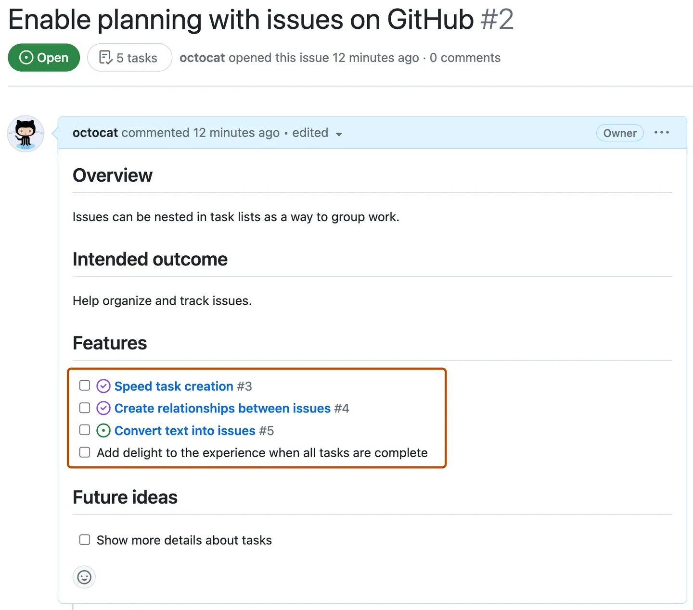

# ¿CÓMO USAR GITHUB ISSUES? Una breve guía de inicio rápido 💻
## 📌 ¿Qué son los *Issues* en GitHub?

- 📝 Los *Issues* son herramientas de seguimiento que permiten:
  - Reportar errores (*bugs*).
  - Sugerir mejoras o nuevas funcionalidades.
  - Hacer preguntas o discutir temas relacionados con el proyecto.
- 👥 Permiten la colaboración entre desarrolladores mediante comentarios y etiquetas.
- 🏷️ Se pueden clasificar usando *labels*, asignar responsables y vincular a *Pull Requests*.

---

## 🔍 Diferencias entre *Issue* y *Pull Request*

| Característica        | Issue 📝                             | Pull Request 🔃                         |
|-----------------------|--------------------------------------|-----------------------------------------|
| Propósito             | Reportar o discutir algo             | Proponer cambios al código              |
| Código involucrado    | No                                   | Sí, incluye modificaciones              |
| Aprobación            | No requiere revisión formal          | Requiere revisión y aprobación          |
| Fusión (*merge*)      | No aplica                            | Puede ser fusionado al repositorio      |
| Conversación          | Sí, mediante comentarios             | Sí, pero centrada en cambios de código  |

---

## 🧠 Recomendaciones para redactar buenos Issues

- ✍️ **Sé específico:** Describe el problema o la propuesta de forma clara y concreta para que cualquier miembro del equipo pueda entenderlo.
- 🗒️ **Incluye contexto:** Agrega información útil como capturas de pantalla, mensajes de error, versiones del sistema o pasos para reproducir el problema.   
- 🔖 **Usa etiquetas adecuadas:** Clasifica el *Issue* correctamente (bug, mejora, documentación, etc.).  
- 👤 **Asigna responsables:** Si es posible, menciona con `@usuario` a quien podría encargarse de resolverlo.  
- 📅 **Agrega fechas o prioridad:** Si aplica, indica la urgencia o fecha límite para atender el *Issue*.

---

## 🧪 Ejemplos prácticos y casos de uso

### ✅ Issue ejemplo 1: Error en la interfaz

> "Al hacer clic en el botón de inicio, la aplicación se cierra inesperadamente."

- 🐞 **Tipo:** Bug  
- 🧑‍💻 **Asignado a:** `@juancito7`  
- 🛠️ **Acción esperada:** Revisar la función del botón en `HomeScreen.js`.

### ✅ Issue ejemplo 5: Documentación incompleta

> "Falta documentación para el proceso de despliegue en `README.md`."

- 📄 **Tipo:** Documentación  
- 🧑‍💻 **Asignado a:** `@laurita3`  
- ✍️ **Acción esperada:** Agregar pasos detallados de despliegue en producción.

---

> ✨ *Un buen Issue no solo reporta, sino que guía a quien lo resolverá.*

--- 
# 🛠️ ¿Cómo crear un Issue en GitHub? 📝

Los **Issues** en GitHub son una excelente manera de reportar problemas, sugerir mejoras o llevar un seguimiento de tareas dentro de un repositorio. 🚀  
A continuación, te mostramos cómo crear un issue paso a paso:

---

## 1️⃣ Acceder al repositorio 🔗
Ve al repositorio donde deseas crear el issue y haz clic en la pestaña **"Issues"**. Aquí es donde podrás visualizar los problemas abiertos y crear nuevos.

  

---

## 2️⃣ Crear un nuevo Issue ➕
Haz clic en la opción **"New Issue"** para comenzar a documentar el problema o tarea.

  

---

## 3️⃣ Escribir un título y descripción detallada 📝
Especifica un **título claro y descriptivo** para tu issue. En la descripción, detalla el problema o tarea, explicando su propósito y cualquier información relevante que ayude a resolverlo. Recuerda incluir datos específicos, imágenes o enlaces si es necesario. 🔍

  

---

## 4️⃣ Personalizar el Issue 🎯
Opcionalmente, puedes mejorar la organización de tu Issue agregando:
- **Etiquetas (Labels)** 🏷️: Para categorizar el problema (ej. "bug", "documentación").
- **Asignaciones (Assignees)** 👥: Para designar responsables.
- **Hitos (Milestones)** 📅: Para establecer fechas o versiones clave.

Estas opciones te ayudarán a mantener mejor estructurado el desarrollo del proyecto.

  

# 🛠️ ¿Cómo organizar y gestionar un Issue en GitHub? 🚀

En el último paso de la creación de un issue, vimos que se podían agregar **etiquetas**, **asignaciones** e **hitos**. Ahora exploraremos cada uno de estos elementos para que puedas gestionar eficientemente tus issues. 🔍

---

## 🏷️ 1. Etiquetas (Labels)
Las etiquetas ayudan a **categorizar** los issues, permitiendo que los usuarios los filtren fácilmente. Puedes usar etiquetas predefinidas o crear las tuyas propias.  
Ejemplos de etiquetas comunes:
- `bug` 🐛 → Reportar errores
- `enhancement` ✨ → Mejoras
- `documentation` 📖 → Cambios en la documentación

  

  

---

## 👥 2. Asignaciones (Assignees)
Las **asignaciones** permiten designar issues a miembros del equipo responsables de solucionarlos. Esto facilita la gestión de tareas dentro de un proyecto colaborativo. 🎯  

  

---

## 📅 3. Hitos (Milestones)
Los **hitos** agrupan issues bajo un objetivo común y permiten establecer una **fecha límite**. Además, muestran el progreso conforme se van completando las tareas, lo que ayuda a planificar el desarrollo. 🏆  

  

---

# 📡 ¿Cómo comunicar y hacer seguimiento de un Issue?

### 💬 1. Comentarios
Una vez creado el issue, puedes agregar **comentarios** para discutir, proponer soluciones o compartir actualizaciones. ¡Es clave para la colaboración! 📝  

### 👀 2. Menciones
Puedes etiquetar a un miembro del equipo usando `@usuario` para que reciba una **notificación** y se involucre en la conversación. 🔔  

  

### ✅ 3. Lista de tareas
Si el issue es complejo, puedes dividirlo en subtareas con una **checklist**. Para hacerlo, usa `- [ ]` antes de cada ítem.  
Si una subtarea requiere más discusión, puedes convertirla en un issue independiente **haciendo clic en el círculo verde** al lado de la tarea. 📌  

  

