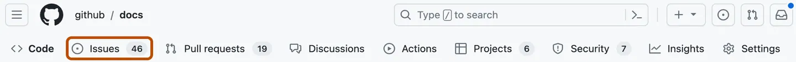
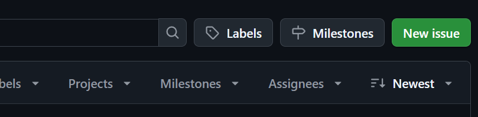
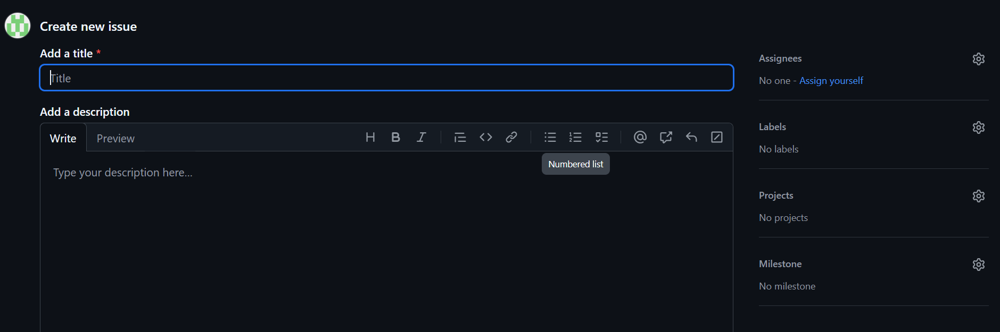
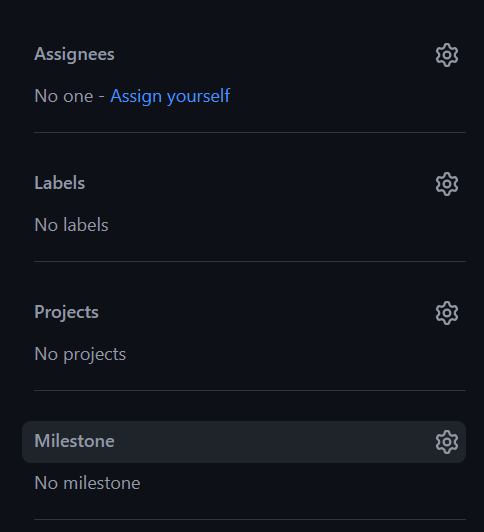
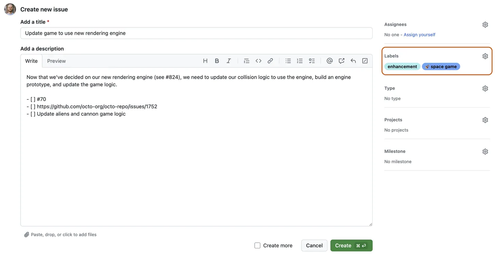
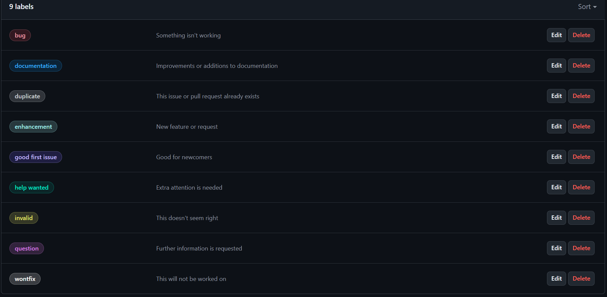
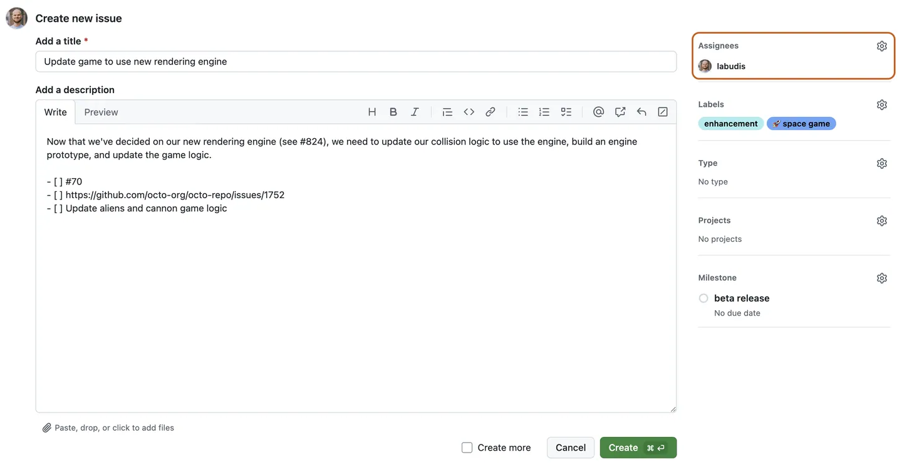
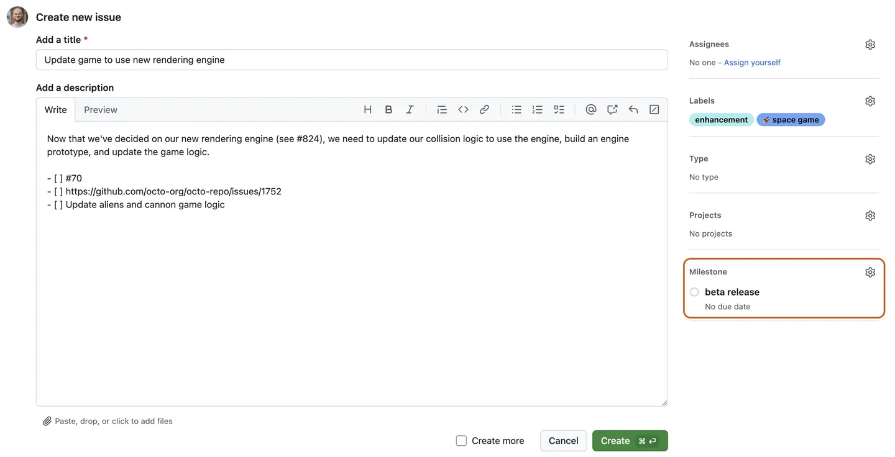
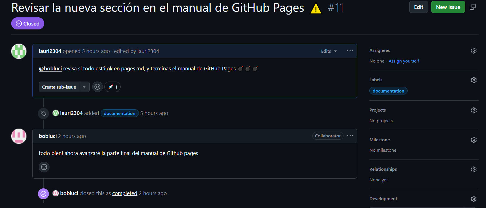
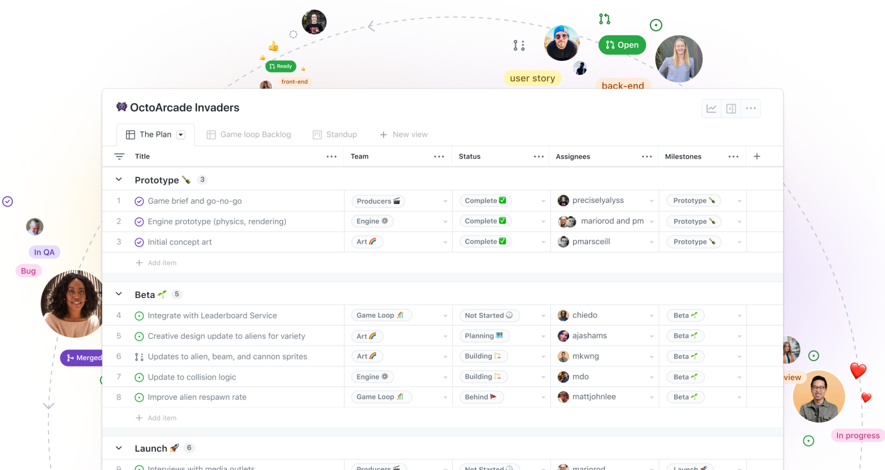

# ¿CÓMO USAR GITHUB ISSUES? Una breve guía de inicio rápido 💻
## 📌 ¿Qué son los *Issues* en GitHub?

- 📝 Los *Issues* son herramientas de seguimiento que permiten:
  - Reportar errores (*bugs*).
  - Sugerir mejoras o nuevas funcionalidades.
  - Hacer preguntas o discutir temas relacionados con el proyecto.
- 👥 Permiten la colaboración entre desarrolladores mediante comentarios y etiquetas.
- 🏷️ Se pueden clasificar usando *labels*, asignar responsables y vincular a *Pull Requests*.

---

## 🔍 Diferencias entre *Issue* y *Pull Request*

| Característica        | Issue 📝                             | Pull Request 🔃                         |
|-----------------------|--------------------------------------|-----------------------------------------|
| Propósito             | Reportar o discutir algo             | Proponer cambios al código              |
| Código involucrado    | No                                   | Sí, incluye modificaciones              |
| Aprobación            | No requiere revisión formal          | Requiere revisión y aprobación          |
| Fusión (*merge*)      | No aplica                            | Puede ser fusionado al repositorio      |
| Conversación          | Sí, mediante comentarios             | Sí, pero centrada en cambios de código  |

---

## 🧠 Recomendaciones para redactar buenos Issues

- ✍️ **Sé específico:** Describe el problema o la propuesta de forma clara y concreta para que cualquier miembro del equipo pueda entenderlo.
- 🗒️ **Incluye contexto:** Agrega información útil como capturas de pantalla, mensajes de error, versiones del sistema o pasos para reproducir el problema.   
- 🔖 **Usa etiquetas adecuadas:** Clasifica el *Issue* correctamente (bug, mejora, documentación, etc.).  
- 👤 **Asigna responsables:** Si es posible, menciona con `@usuario` a quien podría encargarse de resolverlo.  
- 📅 **Agrega fechas o prioridad:** Si aplica, indica la urgencia o fecha límite para atender el *Issue*.

---

## 🧪 Ejemplos prácticos y casos de uso

### ✅ Issue ejemplo 1: Error en la interfaz

> "Al hacer clic en el botón de inicio, la aplicación se cierra inesperadamente."

- 🐞 **Tipo:** Bug  
- 🧑‍💻 **Asignado a:** `@juancito7`  
- 🛠️ **Acción esperada:** Revisar la función del botón en `HomeScreen.js`.

### ✅ Issue ejemplo 5: Documentación incompleta

> "Falta documentación para el proceso de despliegue en `README.md`."

- 📄 **Tipo:** Documentación  
- 🧑‍💻 **Asignado a:** `@laurita3`  
- ✍️ **Acción esperada:** Agregar pasos detallados de despliegue en producción.

---

> ✨ *Un buen Issue no solo reporta, sino que guía a quien lo resolverá.*

--- 
# 🛠️ ¿Cómo crear un Issue en GitHub? 📝

Los **Issues** en GitHub son una excelente manera de reportar problemas, sugerir mejoras o llevar un seguimiento de tareas dentro de un repositorio. 🚀  
A continuación, te mostramos cómo crear un issue paso a paso:

---

## 1️⃣ Acceder al repositorio 🔗
Ve al repositorio donde deseas crear el issue y haz clic en la pestaña **"Issues"**. Aquí es donde podrás visualizar los problemas abiertos y crear nuevos.

<div align="center">
  
</div>

---

## 2️⃣ Crear un nuevo Issue ➕
Haz clic en la opción **"New Issue"** para comenzar a documentar el problema o tarea.

<div align="center">
  
</div>

---

## 3️⃣ Escribir un título y descripción detallada 📝
Especifica un **título claro y descriptivo** para tu issue. En la descripción, detalla el problema o tarea, explicando su propósito y cualquier información relevante que ayude a resolverlo. Recuerda incluir datos específicos, imágenes o enlaces si es necesario. 🔍

<div align="center">
  
</div>

---

## 4️⃣ Personalizar el Issue 🎯
Opcionalmente, puedes mejorar la organización de tu Issue agregando:
- **Etiquetas (Labels)** 🏷️: Para categorizar el problema (ej. "bug", "documentación").
- **Asignaciones (Assignees)** 👥: Para designar responsables.
- **Hitos (Milestones)** 📅: Para establecer fechas o versiones clave.

Estas opciones te ayudarán a mantener mejor estructurado el desarrollo del proyecto.

<div align="center">
  
</div>


# 🛠️ ¿Cómo organizar y gestionar un Issue en GitHub? 🚀

En el último paso de la creación de un issue, vimos que se podían agregar **etiquetas**, **asignaciones** e **hitos**. Ahora exploraremos cada uno de estos elementos para que puedas gestionar eficientemente tus issues. 🔍

---

## 🏷️ 1. Etiquetas (Labels)
Las etiquetas ayudan a **categorizar** los issues, permitiendo que los usuarios los filtren fácilmente. Puedes usar etiquetas predefinidas o crear las tuyas propias.  
Ejemplos de etiquetas comunes:
- `bug` 🐛 → Reportar errores
- `enhancement` ✨ → Mejoras
- `documentation` 📖 → Cambios en la documentación

<div align="center">
  
</div>

<div align="center">
  
</div>


---

## 👥 2. Asignaciones (Assignees)
Las **asignaciones** permiten designar issues a miembros del equipo responsables de solucionarlos. Esto facilita la gestión de tareas dentro de un proyecto colaborativo. 🎯  

<div align="center">
  
</div>

---

## 📅 3. Hitos (Milestones)
Los **hitos** agrupan issues bajo un objetivo común y permiten establecer una **fecha límite**. Además, muestran el progreso conforme se van completando las tareas, lo que ayuda a planificar el desarrollo. 🏆  

<div align="center">
  
</div>

---

## 🔎 ¿Cómo Comunicar y Hacer Seguimiento de un Issue en GitHub?

### 🛠 1. Crear un Issue con Información Clara

Al abrir un issue, asegúrate de incluir estos detalles clave que han sido mencionados en el apartado anterior:

✅ Título preciso → Describe el problema o solicitud brevemente.

✅ Descripción detallada → Explica el contexto, pasos para reproducirlo y posibles soluciones.

✅ Etiquetas (Labels) 🏷️ → Categoriza el issue como Bug, Feature Request, Documentation, etc.

✅ Asignación (Assignees) 👤 → Designa quién será responsable de resolverlo.

Ejemplo de un issue bien estructurado:

````
### 🐛 Error en el cálculo de estadísticas  
**Descripción:** La función de promedio no está calculando correctamente los valores.
**Pasos para reproducir:**  
1️⃣ Ejecutar el script `calcular_estadisticas.py`.  
2️⃣ Comparar el resultado con el cálculo manual.  
**Solución posible:** Revisar la fórmula utilizada en la línea 45 del código.
````  

---

### 🔄 2. Seguir el Issue y Mantener la Comunicación
Para que el seguimiento sea eficiente, utiliza estos métodos:

- 💬 Comentarios (Comments) → Usa @menciones para notificar a colaboradores específicos.

<div align="center">
  
</div>

- ⏳ Estado del Issue (Labels y Milestones) → Actualiza el progreso con etiquetas como In Progress, Fixed, etc.
- 🔗 Referencias a Pull Requests (Linked Pull Requests) → Vincula el issue a una solución en desarrollo.

Ejemplo de comentario útil dentro de un issue:
````
@bobluci ¡Gracias por reportarlo! Estamos revisando la línea 45 del código. 🚀
````

---

### ✅ 3. Cerrar un Issue de Forma Correcta
Antes de cerrarlo, asegúrate de que:
- 🔍 Se ha verificado la solución.
- 📜 Se ha documentado la corrección o cambio realizado.
- 🔗 Se ha vinculado el issue con el Pull Request que lo resolvió (más adelante en esta guía vamos a tratar este punto).
- 🔄 Para cerrar un issue manualmente, usa el botón **Close Issue**, o bien, en un PR, incluye en la descripción:
````
Fixes #23
````
Esto cerrará automáticamente el issue #23 al fusionarse el Pull Request.

<div align="center">
  
</div>

---

### ✅ 4. Uso de Lista de Tareas en Issues
Las listas de tareas permiten dividir un issue en pasos concretos y marcarlos a medida que se completan. Esto es útil para gestionar avances y comunicar qué está pendiente.
- 📌 Cómo crear una lista de tareas

En la descripción de un issue, usa la sintaxis Markdown:
````
### 🚀 Tareas pendientes
- [ ] Revisar la línea 45 del código
- [ ] Probar la solución con datos de prueba
- [ ] Actualizar la documentación
- [x] Crear el Pull Request
````

🔹 [ ] → Elemento pendiente.

🔹 [x] → Elemento completado

- 🔄 Seguimiento de las tareas

A medida que el equipo trabaja en el issue, los elementos de la lista pueden marcarse como completados ✅, ayudando a visualizar el progreso. GitHub también muestra el porcentaje de avance sobre las tareas en la vista del issue.

💡 Ventaja: Puedes referenciar estas tareas en comentarios para coordinar mejor el trabajo:
````
@juancito19 Ya completé la segunda tarea ✅. ¿Puedes revisar la última antes de cerrar el issue?
````


---

## 🔗 Métodos para Vincular un Issue a un Pull Request
 1. 📌 Usando palabras clave en la descripción del PR
Cuando creas un Pull Request, en la descripción puedes incluir una referencia al Issue con una palabra clave como:
````
Fixes #23
Closes #45
Resolves #78
````

🔹 Esto hará que GitHub cierre automáticamente el Issue cuando el PR se fusione.

Ejemplo en la descripción de un Pull Request:
````
Este PR corrige el error en la línea 45 del cálculo de estadísticas.  
Fixes #23  
````
2. 🔗 Usando la sección "Linked issues" en GitHub
- Dentro del Pull Request, puedes vincular manualmente un Issue en la sección "Linked Issues" en la barra lateral.
- Esto no lo cerrará automáticamente, pero dejará claro que el Issue está siendo abordado por ese PR.

### 🔍 Beneficios de Vincular Issues y Pull Requests:

✅ Facilita el seguimiento del trabajo en equipo.

✅ Ayuda a organizar las tareas del repositorio.

✅ Cierra automáticamente los Issues cuando el código se fusiona.

---

## 📊 Integración con GitHub Projects para Gestión Visual


GitHub Projects es una herramienta que permite gestionar tareas y proyectos de forma visual dentro de un repositorio. Su integración con Issues y Pull Requests facilita la organización y seguimiento del trabajo en equipo.

### 🔗 1. Vinculación de Issues y Pull Requests
Puedes asociar Issues y PRs a un tablero de GitHub Projects para visualizar el progreso y estado de cada tarea.

🚀 Pasos para agregar un Issue o PR a GitHub Projects:
- Abre el Issue o Pull Request que quieres agregar.
- En la barra lateral, busca "Projects".
- Selecciona el proyecto en el que deseas incluirlo.

<div align="center">
  
</div>

Esto permite gestionar el avance dentro de tableros Kanban, organizando tareas en columnas como *_Pendiente_*, *_En progreso_* y *_Completado_*.

### 📌 2. Creación de Tableros Personalizados
Los tableros en GitHub Projects pueden personalizarse según el flujo de trabajo del equipo. Algunas configuraciones incluyen:
- ✅ Columnas de estado (To Do, In Progress, Done).
- ✅ Filtros y prioridades para resaltar tareas urgentes.
- ✅ Automatización para mover **Issues** entre columnas según eventos, como cierres de PRs.

Ejemplo de flujo de trabajo en un tablero Kanban:
````
📌 Tareas Pendientes      🔄 En Progreso      ✅ Completadas
------------------------------------------------------------
🎯 Mejorar documentación   🛠 Revisar PR #23    🏁 Fusionar cambios en main  
🐛 Corregir error API      🔎 Analizar pruebas  🔄 Cerrar Issue #45  
````

### 🔄 3. Seguimiento y Actualización del Progreso
GitHub Projects permite actualizar el estado de una tarea fácilmente:
- 💬 Comentarios en Issues para discutir avances.
- 🔄 Arrastrar tarjetas en el tablero para reflejar progreso.
- 📜 Referencias cruzadas entre Issues y PRs para mantener una trazabilidad clara.

💡 **Ventaja:** Permite a los equipos gestionar tareas de manera visual, manteniendo todo organizado sin perder contexto.

<div align="center">
  
</div>

---
